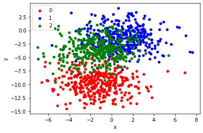

## MMSE: A Multi-Model Stacking Ensemble Learning Algorithm for Purchase Prediction

본 논문은 2019 년 IEEE 학회에 발표되었으며, Stacking 기법을 추천 알고리즘에 적용한 논문입니다. 
전자상거래 사이트에서 사용자의 검색 또는 상품 구매 행위는 전자상거래 기업 DB에 쌓여지고 위 데이터를 기반으로 기업은 사용자의 소비습관을 유추하고, 적절한 시간에 고객에게 상품을 추천합니다. 알리바바는 2015년 Ali Mobile Recommendation Algorithm Alibaba 등 의 추천 알고리즘 대회를 열고 있으며 본 논문은 Alibaba M-Commerce 플랫폼에 적용된 알고리즘입니다.  

본 논문에서 제안하는 추천 알고리즘의 세 단계입니다. 
본 코드는 *3) Stacking Ensemble Model* 에 대한 구현입니다.

1) Feature Engineering : 사용자와 물품간의 100차원 이상의 특징을 추출합니다. 

--
2) Sample Construction : 구입하지 않은 샘플(negative samples) 이 구입한 샘플(positive samples) 보다 훨씬 많으므로 불균형을 조정하기위해 undersampling 을 합니다.
--
3) Staking Ensemble Model 두개의 레이어를 쌓아 첫번째 레이어에서 독립적으로 학습된 모델들의 결과값을 두번째 레이어의 인풋값으로 갖는 Stacking 기법을 사용하여 최종 예측값을 반환합니다.

```python
from sklearn.datasets import make_blobs
from sklearn.metrics import accuracy_score
from tensorflow.keras.models import load_model
from tensorflow.keras.utils import to_categorical
from tensorflow.keras.utils import plot_model
from tensorflow.keras.models import Model
from tensorflow.keras.layers import Input
from tensorflow.keras.layers import Dense
from tensorflow.keras.layers import concatenate
from numpy import argmax
from matplotlib import pyplot
from pandas import DataFrame
```

### Generate Sample Data


```python
# generate 2d classification dataset
X, y = make_blobs(n_samples=1100, centers=3, n_features=2, cluster_std=2, random_state=2)

# scatter plot, dots colored by class value
df = DataFrame(dict(x=X[:,0], y=X[:,1], label=y))
colors = {0:'red', 1:'blue', 2:'green'}
fig, ax = pyplot.subplots()
grouped = df.groupby('label')
for key, group in grouped:
    group.plot(ax=ax, kind='scatter', x='x', y='y', label=key, color=colors[key])
pyplot.show()

# split into train and test
n_train = 100
trainX, testX = X[:n_train, :], X[n_train:, :]
trainy, testy = y[:n_train], y[n_train:]
print(trainX.shape, testX.shape)
```


### Single Model Layer
- Random Forest Algorithm
- Adaboost Algorithm
- Gradient Boosting Decision Trees Algorithm (GBDT)
- XGBoost Algorithm

개별적인 모델의 Accuracy 는 다음과 같다.

- RF's MSE : 0.343
- Adaboost's MSE : 0.374
- GBDT's MSE : 0.361
- XGBoost's MSE : 0.361


```python
from sklearn.datasets import make_classification
from sklearn.ensemble import RandomForestClassifier
from sklearn.ensemble import AdaBoostClassifier
from sklearn.ensemble import GradientBoostingClassifier
from xgboost import XGBClassifier
from sklearn.metrics import mean_squared_error
import joblib as joblib
```

```python
def save_model(model, name):
    joblib.dump(clf, 'models/{}.pkl'.format(name)) 
```

```python
def calc_mse(label, logits):
    mse = mean_squared_error(label, logits)
    print("MSE: {}".format(mse))
```

##### Random Forest Algorithm

```python
rf = RandomForestClassifier(max_depth=30, random_state=0, max_features="sqrt", min_samples_leaf=10)
rf.fit(trainX, trainy)
predy_rf = rf.predict(testX)

calc_mse(testy, predy_rf)
save_model(rf, "Random_Forest")
```

##### Adaboost Algorithm

```python
ada = AdaBoostClassifier(n_estimators=100, random_state=0, learning_rate=0.05)
ada.fit(trainX, trainy)

predy_ada = ada.predict(testX)

calc_mse(testy, predy_ada)
save_model(ada, "Adaboost")

```

##### GBDT Algorithm

```python
gb = GradientBoostingClassifier(random_state=0, learning_rate=0.05, max_features="sqrt", min_samples_leaf=10)
gb.fit(trainX, trainy)

predy_gb = gb.predict(testX)

calc_mse(testy, predy_gb)
save_model(ada, "GBDT")
```

##### XGBoost Algorithm

```python
xgb = XGBClassifier()
xgb.fit(trainX, trainy)

predy_xgb = gb.predict(testX)

calc_mse(testy, predy_xgb)
save_model(ada, "XGBoost")
```

```python
from sklearn.ensemble import StackingClassifier
```

```python
def fit_stacked_model(inputX, inputY):
    
    estimators = [
    ('rf', RandomForestClassifier(n_estimators=10, random_state=42)),
    ('ada', AdaBoostClassifier(n_estimators=100, random_state=0, learning_rate=0.05)),
    ('gb', GradientBoostingClassifier(random_state=0, learning_rate=0.05, max_features="sqrt", min_samples_leaf=10)),
    ('xgb', XGBClassifier()),
    ]
    clf = StackingClassifier(
        estimators=estimators, final_estimator=XGBClassifier()
    )

    clf.fit(inputX, inputY)

    return clf
```
Stacking 기법으로 Ensembel 한 모델의 Accuracy 는 다음과 같다.

- XGBoost's MSE : 0.377

```python
stacked_model = fit_stacked_model(trainX, trainy)
# make predictions and evaluate
predy_staking = stacked_model.predict(testX)
calc_mse(testy, predy_staking)
```
