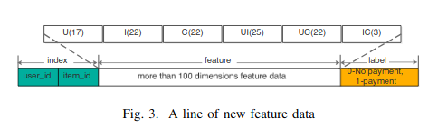

## MMSE: A Multi-Model Stacking Ensemble Learning Algorithm for Purchase Prediction

본 논문은 2019 년 IEEE 학회에 발표되었으며, Stacking 기법을 추천 알고리즘에 적용한 논문입니다. 
전자상거래 사이트에서 사용자의 검색 또는 상품 구매 행위는 전자상거래 기업 DB에 쌓여지고 위 데이터를 기반으로 기업은 사용자의 소비습관을 유추하고, 적절한 시간에 고객에게 상품을 추천합니다. 알리바바는 2015년 Ali Mobile Recommendation Algorithm Alibaba 등 의 추천 알고리즘 대회를 열고 있으며 본 논문은 Alibaba M-Commerce 플랫폼에 적용된 알고리즘입니다.  

본 논문에서 제안하는 추천 알고리즘의 세 단계입니다. 본 코드는 *3) Stacking Ensemble Model* 에 대한 구현입니다.

1) Feature Engineering : 사용자와 물품간의 100차원 이상의 특징을 추출합니다. 

--
2) Sample Construction : 구입하지 않은 샘플(negative samples) 이 구입한 샘플(positive samples) 보다 훨씬 많으므로 불균형을 조정하기위해 undersampling 을 합니다.
--
3) Staking Ensemble Model 두개의 레이어를 쌓아 첫번째 레이어에서 독립적으로 학습된 모델들의 결과값을 두번째 레이어의 인풋값으로 갖는 Stacking 기법을 사용하여 최종 예측값을 반환합니다.

### Stacking Ensemble Model

[Single Model] 
- Random Forest (RF)
- Adaboost
- GBDT
- XGBoost

[Stacking Model]
-XGBoost

개별적인 모델의 Accuracy 는 다음과 같다.

-RF's MSE : 0.343
-Adaboost's MSE : 0.374
-GBDT's MSE : 0.361
-XGBoost's MSE : 0.361

Stacking 기법으로 Ensembel 한 모델의 Accuracy 는 다음과 같다.

-XGBoost's MSE : 0.377

